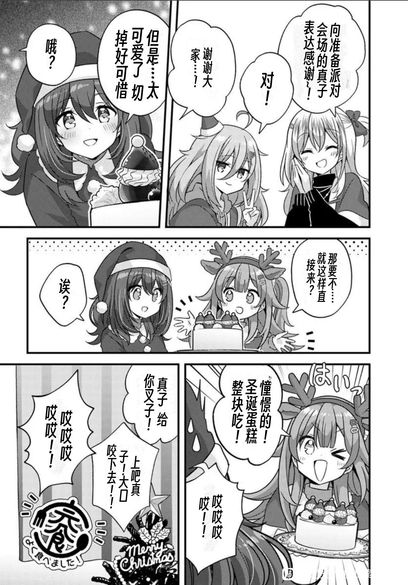
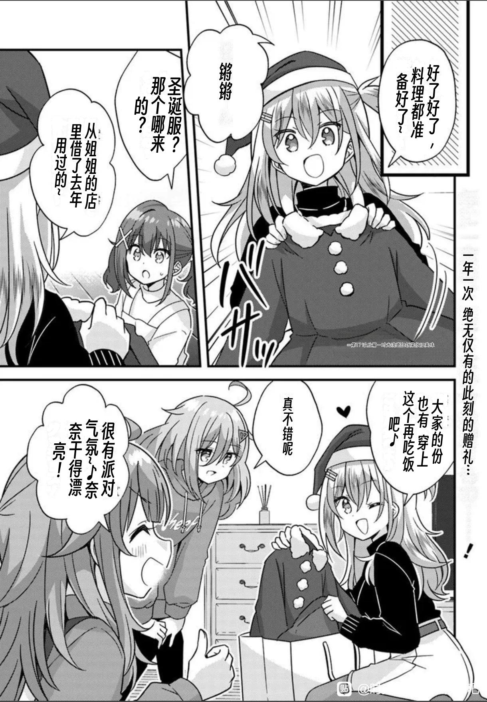

# ComiTrans

<div align="center">

**[English](README_en.md)** ｜ **[简体中文](README.md)**

<br>


</div>

ComiTrans is a fully local manga translation desktop client. Text detection, Japanese OCR, LLM translation, background inpainting, and Chinese typesetting all run locally on your machine, with no browser, server, or web backend required.

Since v2.2.1, detection, OCR, and inpainting are powered entirely by **ONNX Runtime**, removing PyTorch / torchvision / transformers dependencies. The app and models are released as separate packages: the app archive is about 0.4GB, and model updates no longer require re-downloading the program.

## Before / After

> [!NOTE]
> If you need other language, open an issue and i will add it.
> and maybe support add new language by yourself in a future update.

| Before | After |
| --- | --- |
|  |  |
|  |  |

## Table of Contents

1. [Key Features](#key-features)
2. [Quick Start](#quick-start)
3. [Usage](#usage)
4. [Translation Pipeline](#translation-pipeline)
5. [Models](#models)
6. [Packaging & Release](#packaging--release)
7. [Project Structure](#project-structure)
8. [Changelog](#changelog)
9. [FAQ](#faq)
10. [Feedback](#feedback)
11. [License](#license)

## Key Features

- **Fully local desktop client**: PySide6 desktop app with no web pages or backend services.
- **All-ONNX inference**: text detection, Baberu/manga-ocr, and LaMa inpainting all use ONNX; no PyTorch required.
- **Split release packages**: the app archive is about 0.4GB; models ship separately, so app updates do not require re-downloading models.
- **Startup warmup**: the AI pipeline loads automatically when the app opens.
- **GPU inference**: NVIDIA CUDA supported when the machine already has an NVIDIA driver.
- **Multimodal translation toggle**: sends the full page image to the AI and lets it configure font, size, and direction after translation; pure-text mode uses automatic typesetting.
- **Whole-PDF translation**: import PDFs alongside images, translate them page by page, and create one `*_translated.pdf` with the original page order and page sizes.
- **12 font categories**: dialogue, bold dialogue, emphasis, handwriting, thought, whisper, serious, narration, SFX, cute, preview, and title styles with per-glyph fallback.
- **Mask-based erasing and typesetting**: erasing only removes the detector text mask; layout area and center follow the mask.
- **Manual typesetting editor**: adjust font style, size, direction, and position per text block, then save over the output.
- **Error logs with AI diagnosis**: logs go to `Log/app.log`, diagnosis prompts are auto-generated, and multi-turn AI diagnosis is supported.
- **Batch folder selection**: pick a whole folder and images/PDFs are added recursively.
- **Instant stop**: clicking stop immediately enters a cancelled state.
- **Issue feedback**: jump to your configured GitHub Issues link from the top-right button.
- **Adjustable layout**: resize the main areas, preview, and log panels by dragging.

## Quick Start

### Release users (recommended)

1. Download `ComiTrans-v2.2.2-app.zip` (program) and `ComiTrans-v2.2.2-models.zip` (models).
2. Extract the app archive into a `ComiTrans` folder.
3. Extract the models archive into the same `ComiTrans` folder; models will be merged into `ComiTrans\comic-translate-ai\models\`.
4. Double-click `ComiTrans.exe` and enter your translation API key and model on the "API Config" page.

Release users do not need to install Python, PyTorch, pip, or the CUDA Toolkit. GPU acceleration only requires an existing NVIDIA driver.

### Run from source (developers)

Python 3.12+ is recommended; an NVIDIA GPU with CUDA support is optional.

```powershell
cd D:\ComiTrans
python -m venv .venv
.\.venv\Scripts\python -m pip install -r comic-translate-ai/requirements.txt
```

Copy the example config:

```powershell
Copy-Item comic-translate-ai/main/config.example.yaml comic-translate-ai/main/config.yaml
```

Run the client:

```powershell
.\.venv\Scripts\python run.py
```

You can also double-click `start.bat`. The AI pipeline warms up automatically after launch.
## Usage

1. Click "Add Files" or "Add Folder", or drag images, PDFs, or folders into the window.
2. Enter API Key, Base URL, translation model, and Issue link on the "API Config" page. OCR defaults to Auto (Baberu first) and can be switched back to manga-ocr.
3. Enable "Multimodal Translation" to send the full page image to the AI and let it configure fonts; disable it to use pure-text translation and automatic typesetting.
4. Expand "Preferences" on the translation page to fill in background prompts and Chinese character names (one per line; the AI maps them automatically).
5. Click "Start Translation" and watch the live step/status logs.
6. On failure, open the "Error Logs" page for diagnosis prompts, or click the Issue button.
7. Use the "Typesetting Editor" page to fine-tune font style, size, direction, and position per block, then save.

A PDF is shown as one file task and processed internally in page-sized batches. On success, ComiTrans writes `<original_name>_translated.pdf`, preserving page count, order, and page sizes while rasterizing page content. Password-protected PDFs are not supported, and PDF pages cannot yet be adjusted block-by-block in the Typesetting Editor.

### Font styles

| Style | Usage | Default font |
| --- | --- | --- |
| `dialogue` / `bold_dialogue` | Normal / bold dialogue | LXGW WenKai / Source Han Sans Heavy |
| `radiating` / `sfx` | Emphasis / sound effects | Smiley Sans Oblique |
| `handwriting` | Handwritten notes | setofont |
| `thought` / `serious` | Thoughts / formal text | Source Han Serif |
| `whisper` / `cute` | Whisper / playful text | Klee One with glyph fallback |
| `narration` | Wide narration strips | LXGW WenKai |
| `next_preview` / `title` | Preview / title | Klee One / Source Han Sans Heavy |

Normal bubbles default to `dialogue`; OCR content, detector class, original stroke weight, and box geometry select the other styles. Detector orientation is preserved unless the aspect ratio strongly contradicts it. The editor offers Auto, explicit Vertical, and explicit Horizontal modes.

Typesetting renders text on a local 3x supersampled surface and downsamples it with Lanczos, so small dialogue is no longer drawn directly at low resolution. Normal bubbles also avoid a forced white outline for softer edges, while non-bubble text on complex backgrounds keeps an outline for readability.

### Error logs & AI diagnosis

- All runtime logs are written to `Log/app.log`.
- The "Error Logs" page gathers environment info, model paths, recent logs, and stack traces.
- Copy diagnosis prompts, copy raw logs, or open the log file directly.
- AI diagnosis keeps the current log context and multi-turn memory; only "Clear Context" resets it.

## Translation Pipeline

1. **Bubble & text detection**: an ONNX detector outputs bubbles, text masks, and text lines.
2. **Japanese OCR**: Baberu ONNX handles vertical text, varied fonts, SFX, and mixed scripts, with manga-ocr as a compatibility fallback. English-detected or Latin-garbage blocks are preserved.
3. **LLM translation**: pure-text mode translates OCR results; multimodal mode sends the page image and asks the AI to configure font, size, and direction.
4. **Background inpainting**: erases only the detector text mask; simple white bubbles are filled directly, complex backgrounds use LaMa ONNX.
5. **Chinese typesetting**: font size is estimated from the mask area, text is centered on the mask centroid, orientation adapts automatically, and long text gets tighter sizing.
6. **Save & edit**: output images are saved, cleaned canvases go to `<output_dir>_cleaned/`, layout JSON goes to `<output_dir>_layout/`, and the editor lets you refine everything manually.
7. **PDF assembly**: once every page succeeds, pages are rebuilt at their original sizes and the PDF is reopened for validation; no partial PDF is emitted if a page fails.

When the translation provider returns 401/403 (authentication), 402 (insufficient balance), or 404 (endpoint/model not found), the client reports the real cause and stops scheduling remaining pages. HTTP 402 requires funding the API account or switching to a key with available credit.

## Models

| Purpose | Model | Source |
| --- | --- | --- |
| Bubble & text detection | `comic-text-detector.onnx` | [mayocream/comic-text-detector-onnx](https://huggingface.co/mayocream/comic-text-detector-onnx), exported from [dmMaze/comic-text-detector](https://github.com/dmMaze/comic-text-detector) |
| Japanese OCR (default) | `baberu-ocr/` | [genshiai-daichi/baberu-ocr](https://huggingface.co/genshiai-daichi/baberu-ocr), Apache-2.0, 121 MB quantized ONNX tier |
| Japanese OCR (fallback) | `manga-ocr-onnx/` | [l0wgear/manga-ocr-2025-onnx](https://huggingface.co/l0wgear/manga-ocr-2025-onnx), based on [kha-white/manga-ocr](https://github.com/kha-white/manga-ocr) |
| LaMa inpainting | `lama-manga-dynamic.onnx` | manga-lama |

More model sources, alternative ONNX versions, and better detection candidates: [docs/ONNX_MODELS.md](docs/ONNX_MODELS.md).

## Packaging & Release

### Build the app

```powershell
.\build_app.ps1
```

By default the app is built without models. For local testing with models:

```powershell
.\build_app.ps1 -IncludeModels
```

### Generate release packages

```powershell
python package_release.py
```

This creates two archives:

- `ComiTrans-v2.2.2-app.zip`: program only, no models
- `ComiTrans-v2.2.2-models.zip`: ONNX models

Extract the models archive into `ComiTrans\comic-translate-ai\models\`.

## Project Structure

```text
ComiTrans
├── run.py                         # desktop client entry
├── comic-translate-ai/            # AI core
│   ├── main/
│   │   ├── comic_translator_pipeline.py
│   │   ├── onnx_text_detector.py  # ONNX text detection
│   │   ├── onnx_manga_ocr.py      # ONNX Japanese OCR
│   │   ├── onnx_baberu_ocr.py     # Baberu ONNX OCR (default)
│   │   ├── manga_lama.py          # ONNX inpainting
│   │   └── vertical_typesetter.py # Chinese typesetting
│   ├── models/                    # model weights (beside exe in releases)
│   └── font_file/                 # Chinese fonts
├── comic_translate_desktop/       # PySide6 desktop client
├── docs/ONNX_MODELS.md            # model sources & alternatives
├── legacy/web/                    # archived web architecture
├── build_app.ps1                  # build script
└── package_release.py             # release split script
```

## Changelog

### v2.2.2 (2026-09-14)

**New and improved**

- Refreshed the desktop UI and operation feedback with restrained transitions, recursive folder import, and drag-and-drop support.
- Added whole-book PDF import, page-by-page translation, and PDF export.
- Made Baberu ONNX OCR the default, with manga-ocr-onnx kept as a fallback.
- Improved comic typesetting with rounder font choices and 3x supersampling to reduce visible pixelation.
- Rendered double em dashes (`——`) in vertical text as one continuous long vertical line, with expanded font styles and punctuation layout rules.

**Fixes**

- Fixed Issue #19, where an undefined `zhengzai` identifier in the translation API progress log crashed before the request was sent.
- Improved API error classification and guidance for authentication, balance, model, rate-limit, and server failures; fatal failures now stop remaining tasks.

### v2.2.1 (2026-08-07)

**New features**

- Added an output directory setting on the translation workbench; the default output path stays unchanged and stays in sync with the API config page.
- Applied the app icon to the main window and header buttons, and polished the UI styles.
- Multi-page translation optimization: detection/OCR and inpainting/typesetting stay serial, while translation API requests across pages run in parallel (4 workers by default), significantly reducing total processing time.
- Translation API request logs: model, text count, returned count, elapsed time, count mismatch and failure reasons; skipped typesetting now logs a clear warning.
- Stricter translation system prompt: unified JSON object output, strict item count, and mandatory onomatopoeia translation to reduce missing typesetting.
- Tiered font sizes for next-episode previews and narration, with expanded preview keywords (chapter N, preview, final episode, etc.).

**Adjustments**

- Output directories now use `output_page_*`; test assets live in `page/test`, and test output goes to `page/test_output`.
- Test and output directories are excluded from uploads and packaging.

### v2.1.0 (2026-08-06)

**Architecture**

- Rebuilt as a fully local PySide6 desktop client, removing the web stack (Spring Boot / FastAPI / PostgreSQL / Redis / Nginx).
- Switched detection, OCR, and inpainting to ONNX Runtime, removing PyTorch / torchvision / transformers.
- Split releases: ~0.4GB app archive plus a separate models archive.

**New features**

- Startup warmup for the AI pipeline.
- Multimodal translation toggle with AI font/size/direction configuration.
- Manual typesetting editor with save-over.
- Error logs with AI diagnosis and multi-turn context.
- Batch folder selection, instant stop, Issue feedback, draggable layout.
- Special open-source fonts for narration, onomatopoeia, next-episode previews, and titles.

**Fixes & tuning**

- Fixed frozen exe warmup stalls (unittest exclusion, detector dynamic import, pyclipper / unidic / manga_ocr assets).
- Balanced orientation thresholds to reduce horizontal/vertical misclassification.
- Balanced font sizes: larger for vertical text, tighter for horizontal and long text; mask-area sizing and mask-centroid layout.
- Erasing now uses the detector text mask only, not the whole bubble.
- English text blocks are fully skipped: no OCR, no erasing, no typesetting; high Latin/full-width Latin ratio in OCR output is auto-detected and the original text is kept.
- Cleaned canvases moved to `<output_dir>_cleaned/`.
- Removed training/visualization dependencies (matplotlib, wandb, pandas, torchsummary).

### v1.x (archived)

- Web-based manga translation platform: Spring Boot backend, Vue frontend, PostgreSQL / Redis / Nginx, Python worker for image processing.
- Batch translation, text erasing, font classification, horizontal typesetting, hosted models.
- Archived under `legacy/web/`; old docs in `docs/README-v1.md`.

## FAQ

**Do releases require Python or the CUDA Toolkit?**

No. Extract the app and models, then run. GPU acceleration only needs an existing NVIDIA driver.

**Where do models go?**

Beside the exe at `comic-translate-ai/models/`. Release users must extract `ComiTrans-v2.2.2-models.zip` into the same `ComiTrans` folder.

**Why is English text not translated?**

Baberu covers Japanese, Chinese, and English characters, but the current translation flow intentionally preserves detector-labeled English blocks. OCR output with at least 40% Latin/full-width Latin characters is also preserved to avoid erasing site marks and English SFX. Enable multimodal translation when English must be translated.

**Why is the app archive so small?**

Since v2.2.1 everything is ONNX and PyTorch is gone. Detection, OCR, and inpainting only need onnxruntime.

## Feedback

Report issues at [GitHub Issues](https://github.com/Aaaaamadeus/ComiTrans/issues) or use the Issue button in the app. Attach the diagnosis prompt from the "Error Logs" page when possible.

## License

- Project code is released under the license in the repository.
- Fonts: Smiley Sans, LXGW WenKai, Klee One, Source Han Sans/Serif, and setofont are open-source fonts with their own licenses.
- Models: comic-text-detector, manga-ocr, and manga-lama are open-source; see [docs/ONNX_MODELS.md](docs/ONNX_MODELS.md).
