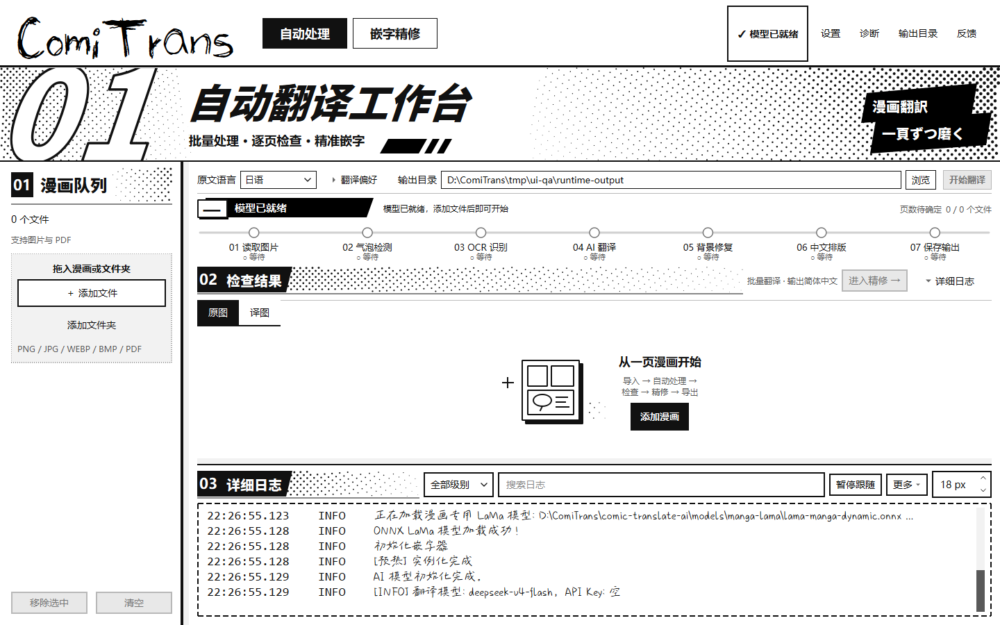
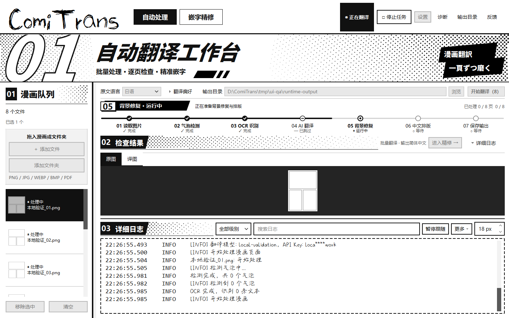
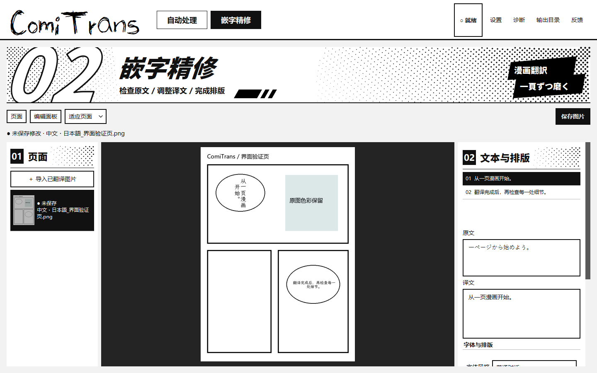
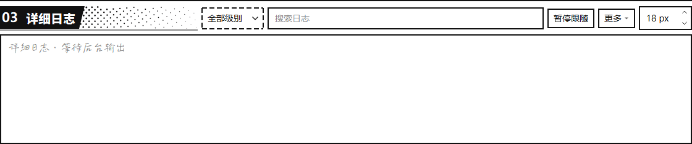

# ComiTrans 桌面 UI 重构记录

## 规范与范围

- 项目根目录的 [style.md](../style.md) 保存了用户提供的规范。第 16–19 节记录漫画视觉强化、网点和参考图要求；第 20 节保存节点轨道、日语角标及指定字体要求；第 21 节保存最新紧凑布局和快速逐字日志要求。冲突时采用较新的用户要求。
- 目标为 PySide6 / Qt Widgets 桌面客户端，沿用现有翻译、OCR、PDF 与嵌字代码；未修改旧 Web 前端。
- 本轮基于工作区已有的多语言 OCR 等未提交改动继续开发。

## 入口映射

| 旧入口 | 当前入口 |
| --- | --- |
| 翻译工作台 | 顶部“01 自动处理”，左侧队列、右侧流程与检查结果 |
| API 配置 | 顶部“设置”，保留翻译服务、OCR、硬件、模型路径、输出目录 |
| 报错日志 | 顶部“诊断”，保留诊断提示词、日志文件及 AI 对话 |
| 嵌字编辑 | 顶部“02 嵌字精修”或结果旁“进入精修” |
| 输出目录 / 反馈 | 顶部全局入口；窄窗口收进“更多” |
| 停止 | 运行中始终显示于全局应用栏；后台终止前显示“正在停止” |
| 背景提示词 / 中文人名 | 自动处理页“翻译偏好” |

## 第二轮视觉实现

`ui/manga_components.py` 用 Qt 实现可复用的章节标题、侧栏标题、分区标题、当前阶段标题。正文标题仍是 QLabel；大号章节编号由字体轮廓绘制，并提供可访问名称。

- `ChapterBanner`：136 px 通栏标题区，约 58 px 思源黑体 Heavy 斜体主标题；白底黑描边的巨大章节编号沿边缘裁切。自动处理页的标题横跨队列与工作区。低高度时压缩为 76 px，并缩小主标题，保持操作空间。
- `PanelHeading`：队列与精修侧栏采用 24 px 粗黑标题和网点侧翼；检查结果与详细日志采用 20 px 反白标题与黑色分格。普通面板没有统一套用粗框和硬影。
- `StageFocus`：32 px 高的当前真实阶段标题块和 23 px 编号，不借助装饰动画模拟进度。
- `StepPanel`：七个圆点位于同一条水平直线上，以当前页面的完成或跳过事件填充轨道。失败、等待不会被后续节点的事件跨越；并行页面状态独立，重复回调不会重新打开已通过的节点。正常高度 54 px，小窗口保持单行并压缩为 36 px。删除重复文件进度条，保留真实页数与文件数。
- 控制区：窗口宽度至少 1180 px 时，原文语言、翻译偏好、输出目录和开始按钮合并一行；窄窗口换成两行。输入框与按钮采用紧凑内边距、13 px 字号，精修表单保持原尺寸。
- 字标使用用户提供的 Skribble；标题角标为「漫画翻訳」「一頁ずつ磨く」。两款用户提供字体位于 `assets/ui/fonts`，已由既有 `assets/ui` 打包清单覆盖。
- `ui/halftone.py` 生成并缓存内联 SVG：45° 黑色圆点，依据参考图改为不透明墨色，以点径和密度形成渐疏效果。标题网点点径 4.8 → 0.6、间距 7 → 11；分区网点点径 3.2 → 0.6、间距 6 → 10。右侧标题网点从页面边缘向中央收疏。SVG 和 Qt 分别指定 multiply 混合，文本保持独立白底或黑底。
- 宽度低于 960 个逻辑像素时，网点间距额外增加 4。队列低高度时调整间距并收起重复提示，保留两个完整导入按钮。空状态小插画的点阵也共用同一个 SVG 组件。
- 装饰组件及其标题子控件设置 `WA_TransparentForMouseEvents`。画布与输入保持干净；日志正文按最新要求快速逐字展开，仍无纹理、叠层或抖动。
- 主队列边界为 4 px，其余内部分隔保持 1 px。当前阶段编号保留硬影；章节编号改为大字描边。圆点轨道通过空心、中心点、勾选、短横线和叉号区分等待、运行、完成、跳过及失败。
- SVG 控件箭头和勾选标识位于 `assets/ui/icons`，通过 `ICON_PATH` 对应的资源根加载；已加入 PyInstaller 数据清单及 QtSvg 导入。

## 第一轮功能与稳定性

- 灰阶、字体工厂与 QSS 集中管理；普通界面使用清晰的无衬线字体。日志正文按用户最新指定使用「Aa今日花晴 春懒猫困」，Qt 注册一次，缺失时回退到常规中文界面字体；时间戳与级别保持等宽。默认 18 px，保留已保存的字号。界面字体不改变漫画输出的嵌字配置。
- 队列支持图片/PDF、文件夹、拖放、移除、清空与文字状态。
- 原图/译图保持原色，使用中性深灰画布；空状态保留导入操作。
- 日志正文使用 16 ms 定时器增量追加，普通速度每帧 4 字、约每秒 250 字；积压超过 512 字时按队列长度加速，每帧最多 1,024 字（组合字符边界可略超）。时间戳和级别完整出现。完整记录与逐字显示队列分离，保留最近 5,000 条逻辑记录，多行消息在同一文本块内；组合重音、变体选择符和连接表情不在帧间拆开。
- 回看、选中文本或搜索暂停跟随，补齐剩余文字并保持选区、滚动位置；返回最新需要主动操作。报错、最终信号、复制和导出立即补齐全文，隐藏页也直接写入。空闲时停止定时器。筛选、搜索、复制、导出、字号均可用；窄窗口的级别与字号在“更多”中。
- 后台新事件包含 task_id、page_id 和阶段状态，兼容旧阶段信号；并行页各自保存阶段状态。真实页数与文件批量计数独立显示。
- 空白页面的翻译标记为“已跳过”；不再把任意阶段事件都当成“运行中”，停止按钮也不提前假报取消。
- 精修支持导入现有译图和配套布局、页面切换、原文查看、译文编辑、字号/方向/偏移、缩放与真实保存结果。保留未保存提示；没有修改时保存不重绘或覆盖原图。加载无布局图片会清空旧编辑状态。
- 队列宽度、日志比例、精修侧栏与缩放通过 QSettings 持久化。窄窗口收起精修侧栏；低高度保留主操作、阶段标题和日志，并可收起日志查看预览。

## 实际运行证据

截图均来自运行中的 Qt Widgets 窗口 `QWidget.grab()`，不是静态设计稿。

### 自动处理空闲（1440 × 900）

真实本地模型预热成功；队列顶部、通栏标题两翼与日志标题使用最新高对比网点，粗斜体主标题与大号描边编号形成视觉重心。

### 处理中与流式日志（1440 × 900）

使用真实本地检测与处理管线运行 8 张程序生成的无文字分镜页。截图时工作线程仍在运行，已收到 41 条日志；当前页通过 4/7 节点，正在背景修复。最终 8 成功、0 失败，轨道填满且跳过标记保留。无文字页跳过外部翻译 API，此验证未请求付费翻译服务。

[运行记录](ui-review/runtime-verification.json)

[全部完成时的节点轨道](ui-review/automatic-complete.png)

### 精修（1440 × 900）

加载本地界面验证页及布局 JSON。测试页局部颜色用于检查皮肤不改变作品颜色，顶栏和侧栏共用最新 SVG 网点。

### 快速逐字显示

下面为实际 Windows Qt 定时器运行的日志面板录屏，使用明确标注的界面测试文本。采样记录捕获到第一条消息的 8 种未完成状态；最终三条原始消息均完整显示，显示队列清空且定时器停止。单元测试另行覆盖积压加速、报错补齐、选区和完整复制。

[逐帧验证记录](ui-review/reveal-verification.json)

## 验证与当前边界

- 现有 59 项业务回归测试此前通过；本轮 15 项桌面回归通过，覆盖 5,000 条日志、选区保持、筛选淘汰、并行事件隔离、取消终态、精修保存失败与元数据兼容，以及节点真实推进、失败截止、跳过保留、绘制出的轨道填充、逐字追加、Unicode 组合字符、完整复制和积压加速。
- 实际 Windows Qt 平台检查 100%、125%、150%、200% 渲染；检查 1440×900、1024×720、960×540 及按屏幕可用空间限制的窗口。网点按逻辑像素绘制，无重复 DPI 放大。
- 最新紧凑布局与指定字体复查 Windows Qt 窗口（1440×900、1024×720、960×540 和 200% 下的 902×485 逻辑尺寸），200% 下日志底部与导入按钮在有效区域内。Qt 实际解析字标为 Skribble、日志为 Aa今日花晴 春懒猫困；中日文、假名、拉丁字母与数字样本文字覆盖检查通过。

  [200% 缩放截图](ui-review/automatic-200-percent.png) · [字体与尺寸检查记录](ui-review/typography-verification.json)

- 参考图存档：[用户提供的样式参考](ui-review/reference-style.png)。仅采用其视觉语言；未使用图中的示例页数、进度或漫画内容作为实际运行数据。
- 精修仍以现有文本块参数为编辑入口；尚无画布拖拽选区、撤销/重做，未放置不可用按钮。
- PDF 可自动处理及预览，现有 PDF 中间布局位于临时目录，尚不支持跨会话精修 PDF。
- 逐字效果作用于已收到的后台日志；后端仍按行发送，没有虚构 token 级流式翻译。C++ 推理运行时直接写入 stderr 的部分信息仍可能只出现在进程控制台。
- 小窗口显示最近日志优先；低于 580 逻辑像素高时输出路径行收起，可通过设置调整路径，通过全局“更多”打开输出目录。
- 当前验证未覆盖一次真实外部 API 翻译。
- v2.3.0 已重建于 `dist/v2.3.0/ComiTrans`，并修复外部 PATH 的 ICU DLL 被误收集导致 Qt 无法启动的问题。Windows 封包 EXE 的 `--smoke-test` 验证通过：真实检测、Baberu、LaMa 预热成功，Skribble 与 Aa 字体、样本文字覆盖及 SVG 正常。该模式采用独立配置和日志，不读取用户 API 密钥。

  [封包启动截图](ui-review/release-startup.png) · [封包检查记录](ui-review/release-verification.json)
